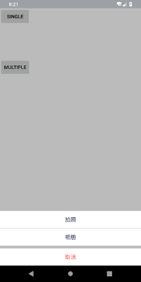
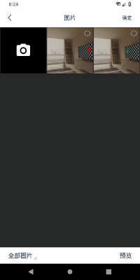

**ScreenShot**:  
  

**Usage**:  
Gradle:
	
	defaultConfig{
		...
		manifestPlaceholders = [MPICKER_PKGNAME:applicationId]
	}
	
Code: 

	MediaSelector.builder()
                    .setMaxSelectCount(10) //max select photo
                    .setUseCamera(true) //use camera or not when in mix mode
                    .setViewMix(true) // pick single photo or multiple photo
                    .setSelected(prePaths) //pre-selected photo path list
                    .start(mActivity, new MediaSelector.IMediaSelectListener() {
                        @Override
                        public void onSelected(ArrayList<String> mediaPaths) {
                            //todo update your listview using
                        }
                    });

Style:

    <!-- define main color -->
    <color name="colorPrimary">@android:color/background_light</color>
                    	
**Note**:  
This lib has integrated with both single and multiple photo selection
The multiple selection part is modified addcoding to [ImageSelector](https://github.com/donkingliang/ImageSelector)
